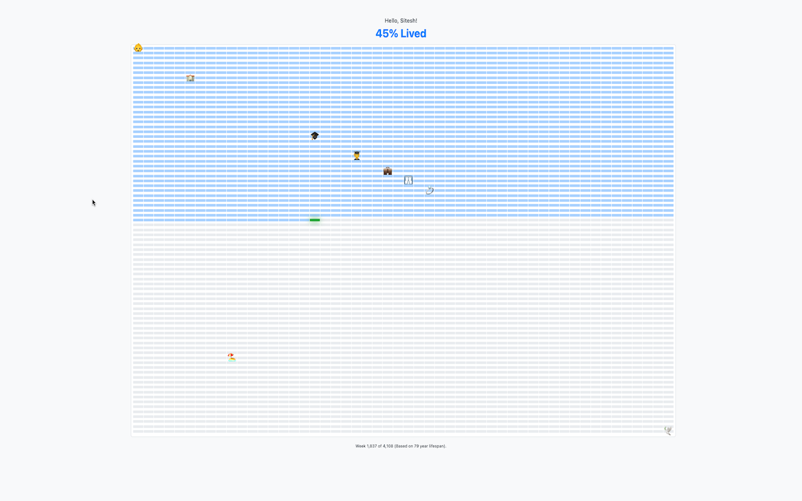

# Life in Weeks - Chrome Extension

## See Your Life, Week by Week

This Chrome extension gently transforms your new tab page into a visual reminder of your time. It displays your life as a grid of weeks, helping you appreciate the weeks passed and look forward to the ones ahead.

## Inspiration

This extension is inspired by the Wait But Why post, [Your Life in Weeks](https://waitbutwhy.com/2014/05/life-weeks.html). The core idea is powerful: seeing your entire life laid out as a grid of countable weeks makes the abstract concept of time feel finite and tangible. It's easy to feel like life is made of countless weeks, but seeing them all laid out puts things in perspective.

Each filled square represents a week gone by, and the grid of empty squares represents the time you still have. It serves as a reminder that this time is yours to fill, encouraging reflection on how you spend each week and motivating you to make the most of the precious, empty squares remaining.

## Installation

1.  Download the extension files from the [GitHub repository](https://github.com/sitz/life-in-weeks).
2.  Open Chrome, go to `chrome://extensions`, and turn on "Developer mode".
3.  Click "Load unpacked" and select the folder where you saved the files.

## How to Use

1.  **Set Your Details:** Click the "Life in Weeks" icon in your Chrome toolbar. A small window will pop up.
2.  Enter your name (optional) and your date of birth.
3.  Click "Save Settings".
4.  **View Your Grid:** Open a new browser tab (`Ctrl+T` or `Cmd+T`). You'll see your personalized life in weeks.

---

Make your weeks count!
