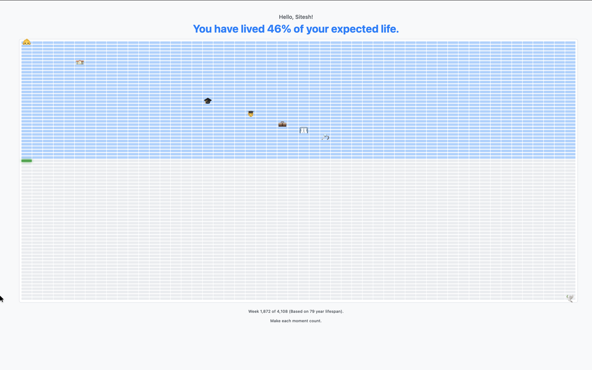

# Life in Weeks

> The days are long, but the years are short.

A Chrome extension that transforms your new tab page into a powerful visual reminder of your time on Earth. Every time you open a new tab, you'll see your entire life displayed as a grid of weeks — each box representing one week of your life.

## 📥 Install

**From Chrome Web Store (Recommended):**

**Manual Installation (for developers):**

1. Clone this repository or download the files
2. Open Chrome and go to `chrome://extensions`
3. Enable **Developer mode** (top right toggle)
4. Click **Load unpacked** and select this folder

## 🚀 Getting Started

1. **Click the extension icon** in your Chrome toolbar
2. **Enter your name** (optional) and **date of birth**
3. **Click Save** — that's it!

Now open any new tab (`Cmd+T` / `Ctrl+T`) to see your life in weeks.

## 🎯 The Philosophy

This extension is inspired by the iconic [Wait But Why post on "Your Life in Weeks"](https://waitbutwhy.com/2014/05/life-weeks.html).

The idea is simple but profound: when you see your entire life as a finite grid of boxes, time stops feeling infinite. Those empty boxes aren't just future weeks — they're opportunities waiting to be filled.

**The green boxes?** Those are behind you.  
**The faded blue boxes?** Those are ahead.  
**That one bright box?** That's *this* week. Make it count.

## 🔒 Privacy

Your data stays on your device. The extension:
- ✅ Stores your settings locally in Chrome sync storage
- ✅ Works completely offline
- ❌ Never sends data to any server
- ❌ Never tracks or analyzes your behavior

## 📄 License

MIT License — do what you want with it.

---

  <em>Make each week count.</em>

